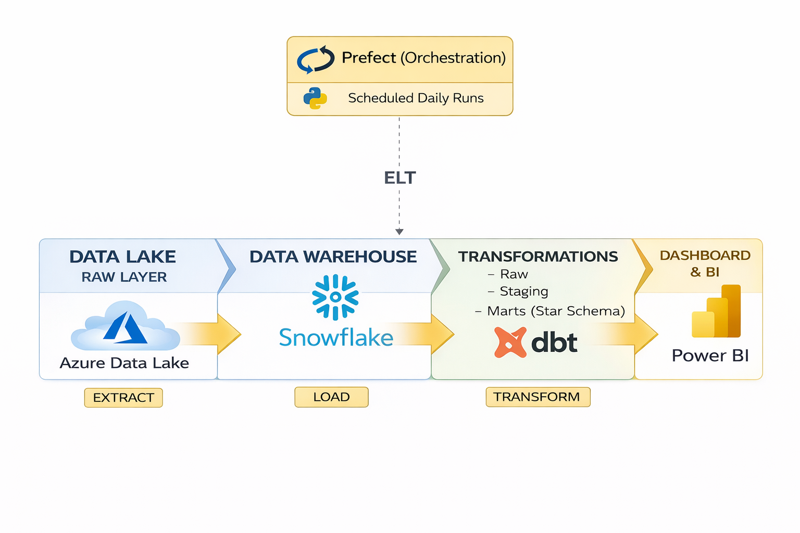
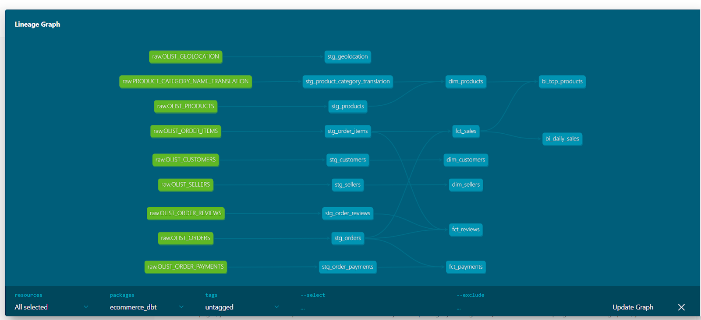

## End-to-End Analytics Engineering Pipeline and Data Warehouse for E-Commerce (Snowflake, dbt, Prefect, Azure Data Lake)

## Overview
This project consisted in the design, development and deployment of a cloud data warehouse, semantic model and ELT pipeline for e-commerce sales analytics. An end-to-end analytics engineering ELT pipeline was built to extract raw data from Azure Data Lake to a Snowflake data warehouse, transform and model the raw data into a star-schema semantic layer (marts) using dbt and incremental logic, run automated tests for data quality and referential integrity, generate documentation, and feed a Power BI executive sales dashboard for real-world decision making. The pipeline is fully automated and orchestrated with Prefect (Python) to run daily at a scheduled time, allowing the business access to relevant and updated information. The project was version controlled from start to end using Git, including feature branching and pull request merging with main.

---

## Business Problem
E-commerce businesses generate large volumes of raw transactional data, but often lack:

- A centralized and reliable data warehouse
- Consistent business definitions (metrics, dimensions)
- Automated pipelines for daily reporting
- Scalable architecture for analytics

This hinders the ability of the business to access key information for daily decision-making, operational problem solving and commercial strategy planning. 

---

## Solution 
An end-to-end ELT pipeline was built to:

- Ingest raw data from Azure Data Lake
- Load data into Snowflake (data warehouse)
- Transform data into a **star schema semantic model** using dbt
- Implement **incremental models for scalability**
- Ensure **data quality with automated tests**
- Orchestrate daily runs using Prefect (Python)
- Deliver insights through a Power BI executive dashboard

---

## Architecture

Azure Data Lake (Landing) -> Snowflake (Data Warehouse) -> dbt transformation (Raw -> Staging -> Marts) -> Semantic Layer -> Power BI Dashboard
Orchestration: Prefect

---

## Tech Stack 
- Azure Data Lake 
- Azure Data Factory
- Snowflake 
- dbt 
- Prefect 
- Power BI (DAX, M, Power Query)
- Python 
- Git

---

## Data model
The data model is structured as a star schema with fact and dimension tables, serving as the semantic layer for business analytics. It is prioritized that the architecture allows for scalability, accuracy, performance, user understanding and business value. 

Fact Tables 
Fact Sales
Fact Reviews 

Dimension Tables 
Dim Customer
Dim Product 
Dim Seller

This structure enables scalability, efficient querying and consistent business definitions.

---

## Pipeline Flow
1. Raw data stored in Azure Data Lake  
2. Loaded into Snowflake (raw layer)  
3. Transformed using dbt:
   - Staging models (cleaning & standardization)
   - Marts (business-ready tables)  
4. Data quality tests executed automatically  
5. Pipeline orchestrated daily with Prefect  
6. Data consumed in Power BI dashboard  

## dbt Lineage

This diagram shows the transformation flow from raw to staging to marts.

---

## Data Quality
- dbt tests:
  - `not_null`
  - `unique`
  - `relationships`
- Ensures:
  - Referential integrity
  - Clean and reliable datasets
  - Trustworthy reporting layer

---

## Warehouse Management 
Specific roles and Snowflake warehouses were created for each process: 

- ANALYTICS_WH and ANALYTICS_ROLE for BI and daily business consumption. 
- INGEST_WH and INGEST_ROLE to extract data from Azure Data Lake into Snowflake. 
- DBT_WH AND DBT_ROLE to transform data from raw to marts (semantic layer)  and perform quality testing. 

Costing was managed by using adequate warehouse sizes and clusters. Multiple clusters were used in the ANALYTICS_WH to manage potential concurrency from daily analytics workflows (e.g. refreshes of multiple dashboards).

--- 

## Business Value
This pipeline enables:

- Daily monitoring of sales performance  
- Customer and product-level analysis  
- Scalable reporting without manual intervention  
- Reliable and consistent business metrics  

Reduces manual reporting effort and enables faster decision-making.

---

## Screenshots
(Add dbt docs + model + dashboard here)

---

## Key Techniques
- Designing scalable ELT pipelines using dbt  
- Implementing incremental models in Snowflake  
- Structuring star schema for analytics  
- Orchestrating pipelines with Prefect  
- Managing version control with Git workflows  

---

## Links
- GitHub Repo  
- Portfolio Website  
- LinkedIn  

OVERVIEW 
BUSINESS PROBLEM 
SOLUTION 
TECH STACK 
ARCHITECTURE 
DATA MODEL / WORKFLOW 
KEY FEATURES 
RESULTS / BUSINESS VALUE 
SCREENSHOTS 
REPOSITORY STRUCTURE 
HOW TO RUN 
KEY LEARNINGS 
CONTACT 