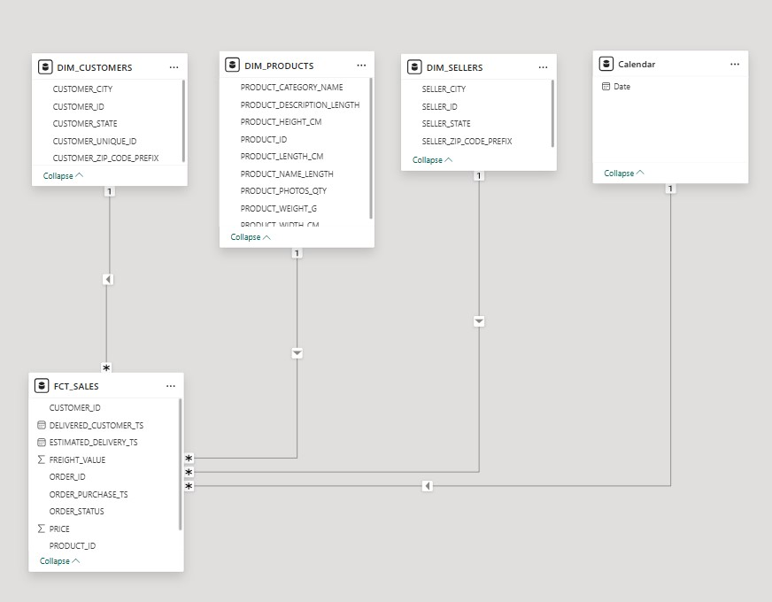
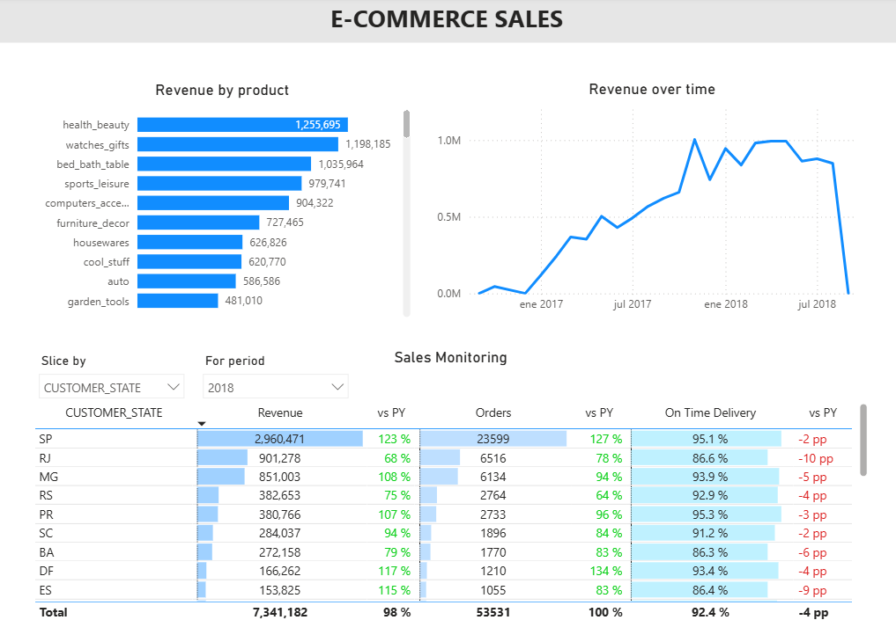
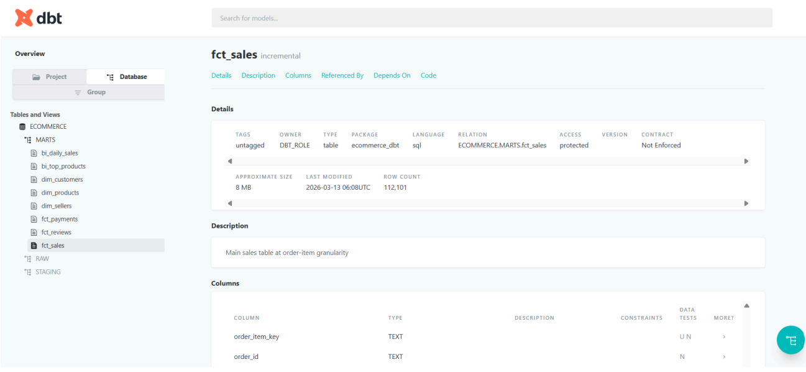
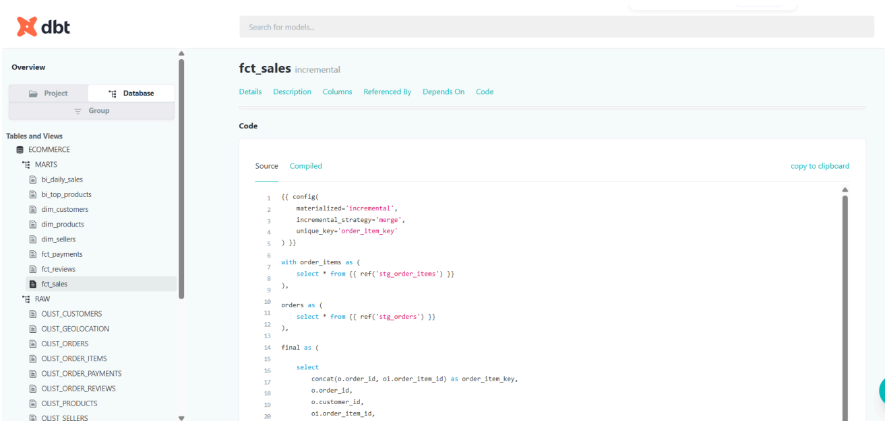
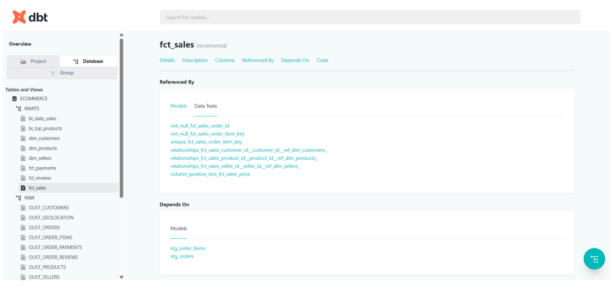

## End-to-End Analytics Engineering Pipeline and Data Warehouse for E-Commerce (Snowflake, dbt, Prefect, Azure Data Lake)

## Overview
Production-ready ELT pipeline and cloud data warehouse for e-commerce analytics. Processes and models e-commerce transactional data to enable scalable, automated analytics and decision-making.

Designed and built an end-to-end ELT pipeline that ingests raw data from Azure Data Lake into Snowflake, transforms it into a star-schema semantic model (marts) using dbt, and delivers business-ready insights through a Power BI executive dashboard.

The pipeline is fully automated and orchestrated with Prefect (Python), running on a daily schedule to ensure consistent access to reliable and up-to-date data.

Key components include:
- Data ingestion and loading into Snowflake (data warehouse) from Azure Data Lake
- Transformation using dbt (raw -> staging -> marts), including incremental logic 
- Automated testing for data quality and referential integrity (dbt tests)
- Semantic layer design (star schema, dimensional modeling)
- Power BI dashboard for end user analytics and decision making
- Orchestration with Prefect
- End-to-end version control using Git

---

## Architecture

### ELT Pipeline (Extract, Load, Transform)

Azure Data Lake → Snowflake → dbt → Semantic Layer → Power BI | Orchestration: Prefect

### Semantic Layer (Data Warehouse)

### Executive Dashboard

---

## Tech Stack 
- Azure Data Lake 
- Azure Data Factory
- Snowflake 
- dbt 
- SQL
- Prefect 
- Power BI (DAX, M, Power Query)
- Python 
- Git

---

## Business Problem
E-commerce businesses generate large volumes of raw transactional data, but often lack:

- A centralized and reliable data warehouse
- Consistent business definitions (metrics, dimensions)
- Automated pipelines for daily reporting
- Scalable architecture for analytics

This hinders the ability of the business to access key information for daily decision-making, operational problem solving and commercial strategy.

---

## Solution 
An end-to-end ELT pipeline was built to:

- Ingest raw data from Azure Data Lake
- Load data into Snowflake (data warehouse)
- Transform data into a **star schema semantic model** using dbt
- Implement **incremental models for scalability**
- Ensure **data quality with automated tests**
- Orchestrate daily runs using Prefect (Python)
- Deliver insights through a Power BI executive dashboard

---

## Pipeline Flow
1. Raw data stored in Azure Data Lake  
2. Loaded into Snowflake (raw layer)  
3. Transformed using dbt:
   - Staging models (cleaning & standardization)
   - Marts (business-ready tables)  
4. Data quality tests executed automatically  
5. Pipeline orchestrated daily with Prefect  
6. Data consumed in Power BI dashboard  

## dbt Lineage

This diagram (DAG) shows the transformation flow from raw to staging to marts.

## Incremental modeling 
Incremental logic was implemented in the `fact_sales` model to process only new data, improving performance, scalability and reducing compute costs.

Below is an example of the dbt model configuration and documentation:

---

## Data Quality
- dbt tests:
  - `not_null`
  - `unique`
  - `relationships`
- Ensures:
  - Referential integrity
  - Clean and reliable datasets
  - Trustworthy reporting layer

---

## Semantic Layer (Data Model)
The data model is structured as a star schema with fact and dimension tables, serving as the semantic layer for business analytics. It is prioritized that the architecture allows for scalability, accuracy, performance, user understanding and business value. 

**Fact Tables**
- Fact_Sales
- Fact_Reviews
- Fact_Payments

**Dimension Tables**
- Dim_Customers
- Dim_Products
- Dim_Sellers 

This structure enables scalability, efficient querying and consistent business definitions.

## Warehouse Management 
Specific roles and Snowflake warehouses were created for each process: 

- ANALYTICS_WH and ANALYTICS_ROLE for BI and daily business consumption. 
- INGEST_WH and INGEST_ROLE to extract data from Azure Data Lake into Snowflake. 
- DBT_WH AND DBT_ROLE to transform data from raw to marts (semantic layer)  and perform quality testing. 

Costing was managed by using adequate warehouse sizes and clusters. Multiple clusters were used in the ANALYTICS_WH to manage potential concurrency from daily analytics workflows (e.g. refreshes of multiple dashboards).

--- 

## Dashboard 
A Power BI sales dashboard was developed to visualize key business metrics, trends and performance indicators, enabling interactive analysis at customer, product and time levels. The data for the dashboard is consumed directly from the semantic layer in Snowflake.

## Business Value
This pipeline enables:

- Daily monitoring of sales performance  
- Customer and product-level analysis  
- Scalable reporting without manual intervention  
- Reliable and consistent business metrics  

Reduces manual reporting effort and enables faster decision-making.

---

## Key Techniques
- Designing scalable ELT pipelines using dbt  
- Implementing incremental models in Snowflake  
- Structuring star schema for analytics  
- Orchestrating pipelines with Prefect  
- Managing version control with Git workflows  

---

## 🔗 Links
- 🚀 [Project Repository](https://github.com/FedericoGarland/ecommerce-analytics-elt)
- 🌐 [Portfolio Website](https://federicogarland.github.io/FedericoGarlandWebsite/)
- 💼 [LinkedIn Profile](https://www.linkedin.com/in/federico-garland/)
